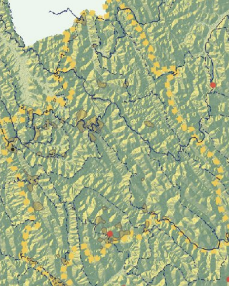

# Rwanda 

This is my final project on Rwanda

## Yemen ADM Subdivisions

At first I chose Yemen as my country which is broken down into 22 governorates and further into 333 districts. Along with my adm break down of the whole country, I chose to look at the districts within Sana'a, the capital of Yemen, and Aden, the second most populous governorate of Yemen after Sana'a. As I moved forward in the class, Yemen proved to be too computationally intesive because of the large amount of districts it holds, so I switched my country to Rwanda for the rest of the semester. 

## Rwanda ADM Subdivisions and Population 

Rwanda is a small landlocked country in east-central Africa with a very high population density. 

Rwanda was originally divided into twelve provinces, but in 2006, in an effort to reduce the ethnic divisions created by the 1994 genocide, the subdivisions were replaced by five main provinces, which contain 30 districts total. The main subdivisions are the Northern, Southern, Eastern, Western, and Kigali City Provinces. 

The image above shows the breakdown of the five provinces as well as the population distribution of the districts in the country. Rwanda has a few major towns, and its biggest urban area is Kigali City, which is the smallest province, but has a population of over 700,000. 

The histo-bar graph below complements this by showing that most population levels hover around the same level, but there are a few cities, including Kigali, with much greater population levels. 

When estimating the population using covariate data with the means, logpop, and summation method, the mean prediction proved to be the most accurate as it had the lowest difference value of 5,754,771. In the map below, it shows that most of the predictions were fairly accurate, except the capital city of Kigali was very underestimated. 

## Rwanda Urban Populations

The regions I chose to focus on were the Gicumbi and Rulindo neighboring districts in the Northern Province of Rwanda. The map above shows the location of the urban areas in relation to the topography. Rulindo has 35 small urban areas in the northern and southern regions of the district, and Gicumbi has 12 more centralized small urban areas. The urban areas in the south are clustered above Kigali. The formation of the urban areas is interesting because they form in small clusters, instead of larger areas. 

The map above sheds light on why the urban areas form in small clusters. Rwanda is known as "le pays des mille collines" which translates to "the country of a thousand hills" which describes the topography of the country. The region is especially mountainous which dictates how the urban areas are formed. The urban areas have to work around the mountains, and therefore cannot be very spread out, and for the most part, the rest of the country lives in rural areas along hillsides. 

The mountains also dictate how the roadways are formed, because the roads have to go through the mountains and cannot just cut across. For the most part the roadway system is fairly efficient as it goes through most urban areas and is the primary form of transportation within the country. 

## Healthcare Access 

Within the two regions there is only one hospital, and it is in Rulindo. The hospital is located within the cluster of urban areas in the south of the region and is accessible by the secondary road networks. There are also three other hospitals outside the regions that are also accessible by the road networks, and one pharmacy towards the north of Rulindo. 

The healthcare system is currently one of the best in Africa, after a giant push from the government for universal healthcare in the post-genocide era. Currently, almost ten percent of the government budget is dedicated to healthcare. The hospital in Rulindo is the Rutongo District Hospital which serves over 290,000 people in over 17 sectors, and has recently been renovated by the Ministry of Health to accomodate all the people that it serves. Currently there are 42 district hospitals and four main referral hospitals in the country. The closest referral hopital to the region is the King Faisal Hospital which is plotted on the maps above. 

Rwanda's healthcare has been increasing rapidly to try and reform the country after the genocide left it in ruins. With help from both the government and NGOs, the country has been able to provide universal healthcare for its people and rennovate many of the hospitals. Although the country has significantly improved, there is still a great need for specialized healthcare access and access in more rural areas of the country. 

